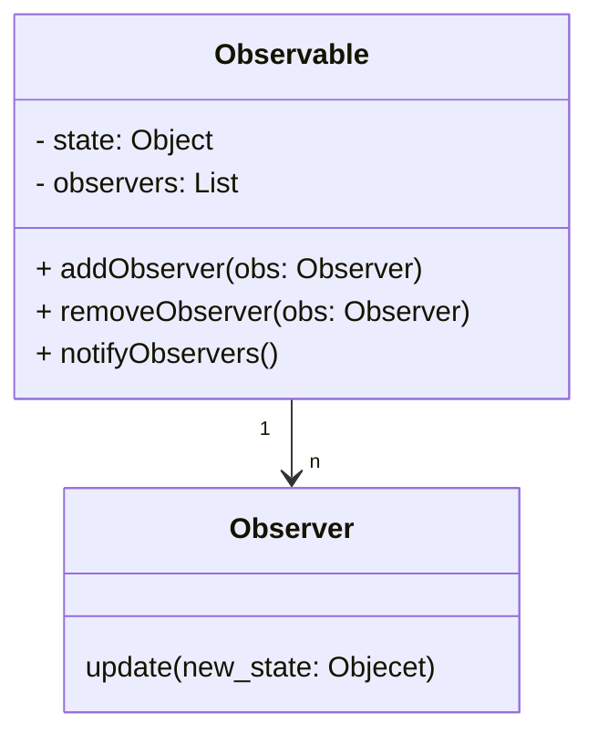

# Observer Pattern 
**Ein Objekt** hält den Zustand von Informationen  
**Mehrere Objekte** sind wollen die Informationen nutzen

- Inversion of Control
  - Nicht die Abhängigen EInheiten sollen INformationen anfragen, eine Unabhängige Einheit "pusht" die Informationen an die Abhängigen
- Loose Coupling
  - Möglichst wenig Abhängigkeiten

# Aufgabe
Ein lokaler Nachrichtendienst bietet einen Infoservice aus der Region: politische Nachrichten, Wirtschaftsinformationen, Stellenanzeigen (Array von Texten) und Sportinfos.
Marc (Typ Sportfan) interessiert sich immer nur für den Sportteil. Die Firma Aktifry möchte alle Wirtschaftsinformationen und politische Nachrichten erhalten. Frau Meyer (Typ Allesleser) liest alle vier Bereiche.

1. Modellieren Sie den Nachrichtendienst.
2. Bietet sich hier die Push- oder die Pull-Methode zum Übertragen von Infos an? 
3. Wann rufen Sie die notify-Methode auf? Begründen Sie Ihre Entscheidung. Worin liegen die Nachteile Ihrer Alternativen.

# BUms
 - isdf
 - s
 - df
 - sdf

